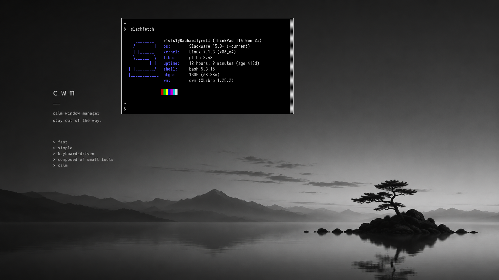
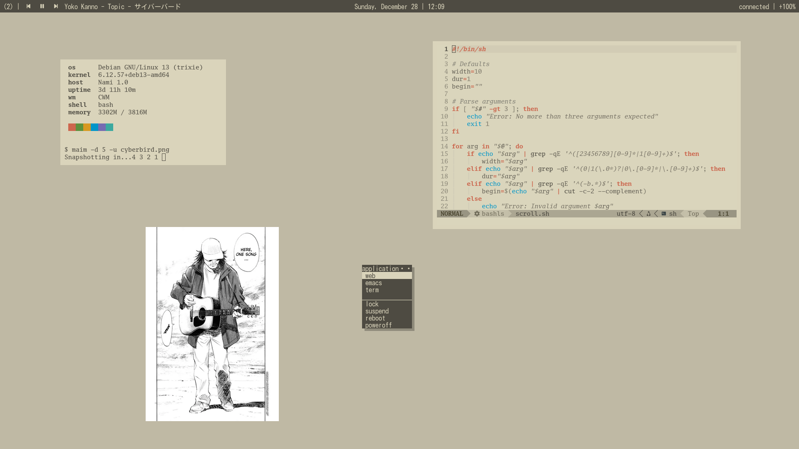
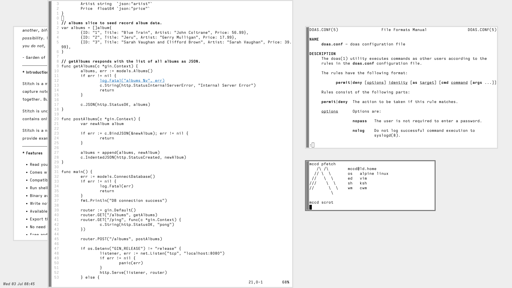
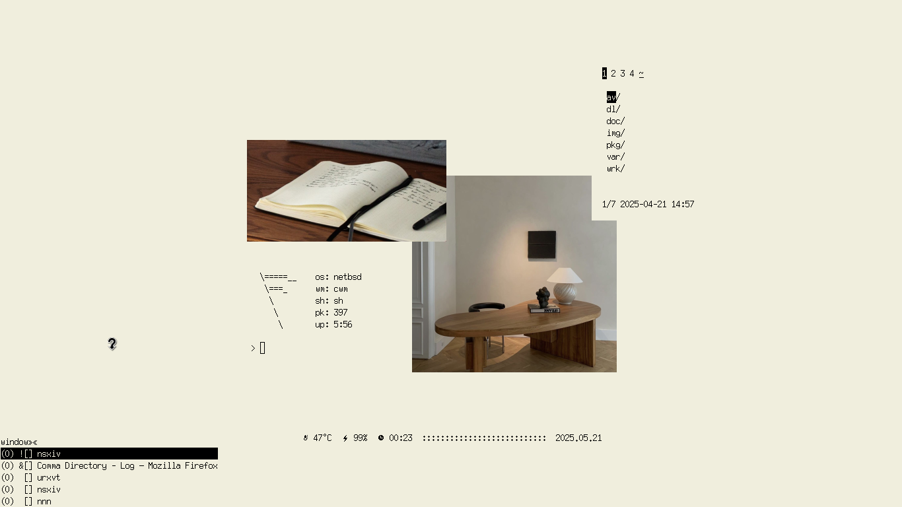
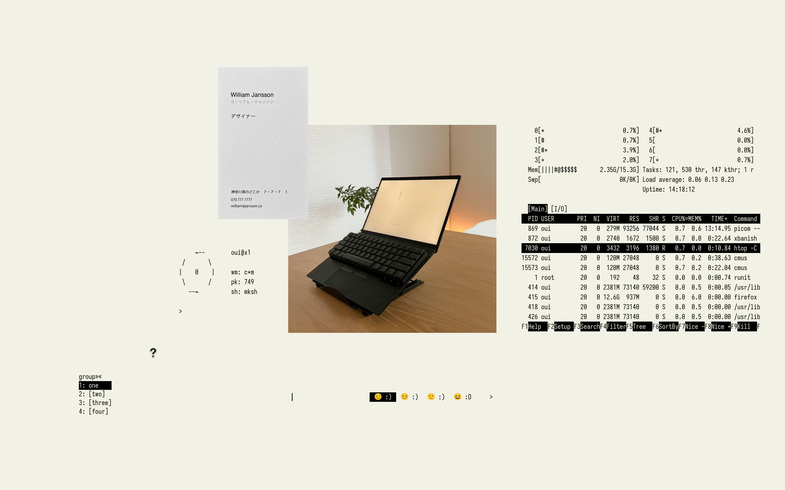
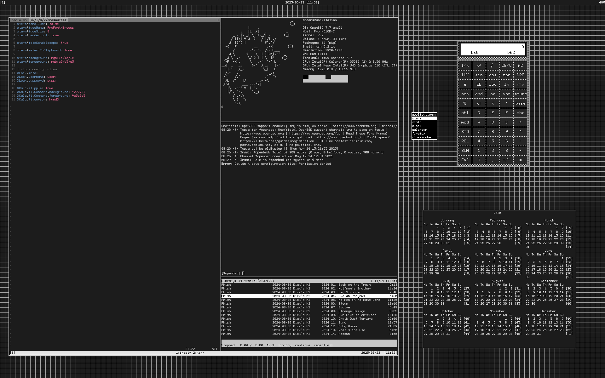
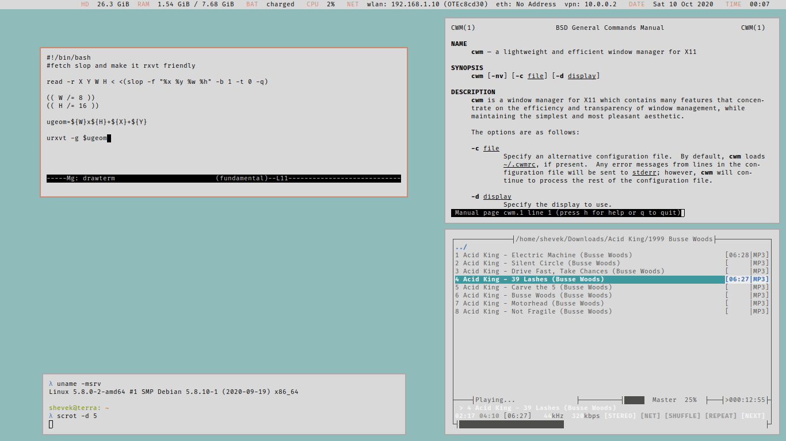

# Calm Window Manager (CWM) configuration, workflows and desktop showcase

My minimal Calm Window Manager (CWM) setup for Slackware Linux, along with a
small, curated showcase of real-world CWM desktops. The daily setup runs on
Slackware, but the CWM configuration and workflow ideas can be adapted to
other X11 systems.

This repository is the practical showcase of [Window Manager Agnostic Workflows](https://github.com/r1w1s1/code-notes/blob/main/notes/Window_Manager_Agnostic_Workflows.txt). It is the keyboard-driven X11 desktop I use day to day, built around CWM, dmenu-style helpers, and small shell scripts. CWM handles window management and the global keyboard workflow.

CWM is a lightweight X11 window manager with floating windows, groups, and
optional tiling commands. This repository shows those features in a real daily
configuration rather than providing a turnkey installation.



## How It Works

`.xinitrc.cwm` prepares the X session, starts the shared helpers, and then
executes CWM. The window manager is the last component in the startup chain.

```text
startx
  |
  +-- .xinitrc.cwm
  |     |
  |     +-- load .xprofile, X resources, and keymaps
  |     +-- start the DBus session bus
  |     +-- source .xinitrc.common
  |     |     |
  |     |     +-- optional screen saver / DPMS
  |     |     +-- keyboard layout
  |     |     +-- xhidecursor
  |     |     +-- wallpaper
  |     |
  |     +-- exec cwm --------------- window management
  |
  +-- CWM and shell helpers provide the desktop workflow
```

## Idea

The setup follows a window-manager-agnostic workflow:

- CWM handles focus, groups, window movement, resizing, and borders.
- CWM handles global shortcuts for launching programs, locking, screenshots, audio, and brightness.
- shell scripts provide the desktop helpers used by those shortcuts.
- `.xinitrc.common` starts shared session components.
- `.xinitrc.cwm` prepares the X session and selects CWM as the final window manager.

## Workflow

The configuration is divided into two kinds of behavior:

- CWM-specific actions stay in `.cwmrc`: focus, groups, movement, resizing, and appearance.
- Global desktop actions stay in `.cwmrc` and shell helpers: launching programs, locking, screenshots, audio, and brightness.

This keeps the daily keyboard workflow separate from the window manager. CWM can
change without requiring the global shortcuts and desktop helpers to be rebuilt.

## Screenshots

The [screenshots gallery](screenshots/README.md) is a small, manually curated
collection of CWM desktops. Screenshots from other users remain attributed to
their original authors and link back to the original Reddit post. This
repository does not claim ownership of those images.

### Preview

<div>
<a href="screenshots/README.md#cwm-cyberbird"></a>
<a href="screenshots/README.md#cwm-my-genera-inspired-unix-machine"></a>
<a href="screenshots/README.md#cwm-my-quiet-space"></a><br>
<a href="screenshots/README.md#cwm-thinkpad-endgame"></a>
<a href="screenshots/README.md#cwm-openbsd-simple-practical"></a>
<a href="screenshots/README.md#cwm-astigmatism-friendly"></a>
</div>

## Resources

More background:

- [Window Manager Agnostic Workflows](https://r1w1s1.srht.site/posts/window-manager-agnostic-workflows/) - the design principle behind keeping global shortcuts and desktop helpers outside CWM.
- [Developer blog: jasper@: cwm in Xenocara](https://undeadly.org/cgi?action=article;sid=20070712103624) - historical CWM context from the OpenBSD Journal (2007), including its keyboard-driven and deliberately lightweight character.
- [Getting started with cwm](https://undeadly.org/cgi?action=article;sid=20090502141551) - practical background on groups, `sticky`, `autogroup`, and keyboard-driven configuration.
- [cwm, just right](https://williamjansson.com/posts/cwm/) - a recent personal perspective on CWM's small size, stacking model, and low cognitive load.
- [pguerin3/cwmrc](https://github.com/pguerin3/cwmrc) - extensive CWM configuration and workflow examples.
- [OpenBSD's CWM: An Underrated Window Manager (Plus a Comfy Config)](https://ianlecorbeau.com/blog/openbsd-cwm.html) - practical overview of CWM groups, bindings, menus, appearance, `sticky`, `autogroup`, and manual `htile`/`vtile`, with a substantial commented `.cwmrc`. [Archived copy](https://web.archive.org/web/20260818163633/https://ianlecorbeau.com/blog/openbsd-cwm.html).
- [OpenBSD: cwm](https://astro-gr.org/openbsd-cwm/) - a detailed OpenBSD setup organized around groups, `sticky`, `autogroup`, application bindings, and small helper scripts. [Archived copy](https://web.archive.org/web/20260818163545/https://astro-gr.org/openbsd-cwm/).
- [cwm](https://nein.triapul.cz/cwm) - concise workflow notes for desktop switching, moving windows between groups, window menus, and basic horizontal or vertical tiling. [Archived copy](https://web.archive.org/web/20260818163944/https://nein.triapul.cz/cwm).

## Files

- [`.cwmrc`](.cwmrc) - CWM appearance, groups, mouse bindings, and WM-specific keybindings.
- [`examples/cwmrc`](examples/cwmrc) - small, commented reference configuration for creating your own `.cwmrc`.
- [`.xinitrc.cwm`](.xinitrc.cwm) - X session entrypoint for CWM.
- [`.xinitrc.common`](.xinitrc.common) - shared X session helpers used before starting the WM.
- [`bin/dmenu_run.sh`](bin/dmenu_run.sh) - styled `dmenu_run` launcher wrapper.
- [`bin/menu`](bin/menu) - small dmenu-based desktop menu.
- [`bin/screenshot-full.sh`](bin/screenshot-full.sh) - full-screen screenshot helper.
- [`bin/screenshot-area.sh`](bin/screenshot-area.sh) - selected-area screenshot helper.
- [`bin/toggle-call-audio.sh`](bin/toggle-call-audio.sh) - personal PipeWire/Bluetooth audio toggle.
- [`cwm.png`](cwm.png) - screenshot of the setup.
- [`screenshots/`](screenshots/) - curated CWM desktop showcase.
- [`cwm-quickref.md`](cwm-quickref.md) - concise day-to-day CWM quick reference.

## Quick Reference

The [CWM Quick Reference](cwm-quickref.md) covers common day-to-day bindings,
groups, `autogroup`, movement, resizing, and configuration.

## .cwmrc

The [`.cwmrc`](.cwmrc) contains the complete CWM configuration, including
appearance, window management, groups, and the keyboard shortcuts for the
current X session. The [`examples/cwmrc`](examples/cwmrc) file is a more
generic, commented starting point for creating your own configuration. A few
of the practical CWM features used here are:

- `sticky yes` makes new windows inherit the currently selected group.
- `autogroup 1 firefox` places Firefox windows in group 1 automatically.
- `group-only-N` switches to one group, while `window-movetogroup-N` moves the
  current window to a group.
- `window-vtile` and `window-htile` provide simple vertical and horizontal
  tiling when needed.
- `bind-key` and `bind-mouse` connect keyboard and mouse actions to CWM
  commands or shell helpers.

## Dependencies

- Core: CWM, X11, and `startx`.
- Workflow: `dmenu`, `st`, `tabbed`, and `tmux`.
- Session helpers: `setxkbmap` and `xhidecursor`.
- Optional screen saver: `xscreensaver`, `xscreensaver-command`, and `xset` for display power management.
- Desktop helpers: ImageMagick `import`, `brightnessctl`, and PipeWire `pactl`.
- [uw-ttyp0](https://slackbuilds.org/repository/15.0/system/uw-ttyp0/) - provides the Ttyp0 font used by CWM and dmenu.

Bluetooth support for `toggle-call-audio.sh` additionally requires
`bluetoothctl` and matching local PipeWire device names.

## Notes

This is not a full desktop environment or a turnkey installer. It is the daily
configuration of `r1w1s1` and a reference implementation of a modular CWM/X11
workflow. It can be copied selectively or adapted into another portable X11
workflow. Some entries use personal paths, hardware-specific audio names, or
commands that are not included in this repository.

Some paths, hardware names, and personal commands need adjustment before use.
